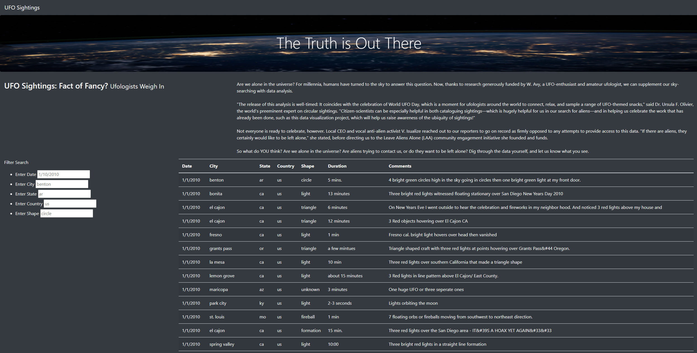
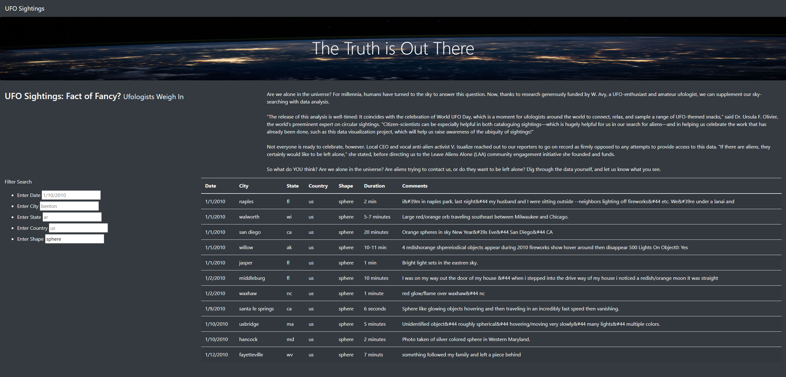
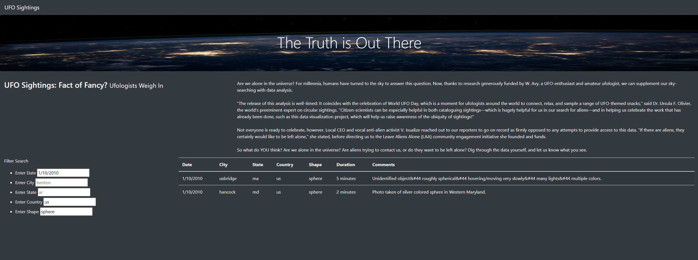

# UFOs
## Project Overview
The purpose of this project was to create a website about UFO sightings using JavaScript, HTML, and CSS that contained a dynamic and filterable table.

## Project Results
A visitor to this website could filter the UFO table to return sighting thats meet the criterias of their choosing. The visitor could filter on one or up to five different criterias, such as date, city, state, country, and shape.

### No filters

### One Filter

### Three Filters

## Project Summary
### Webpage Drawback
One drawback of this design is that it can be hard to read since there is a lot to it. At first glance your eyesite is not primarily directed to the most important thing on the page.

### Webpage Recommendation
- Recommend to put the table in a separate page from the main index.
- Recommend to make the table scrollable without moving down the actual web page.

